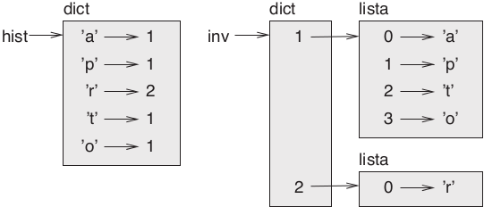

## 11.5 - Dicionários e listas

As listas podem aparecer como valores em um dicionário. Por exemplo, se você receber um dicionário que mapeie letras e frequências, é uma boa ideia invertê-lo; isto é, crie um dicionário que mapeie de frequências a letras. Como pode haver várias letras com a mesma frequência, cada valor no dicionário invertido deve ser uma lista de letras.

Aqui está uma função que inverte um dicionário:

```python
def invert_dict(d):
    inverse = dict()
    for key in d:
        val = d[key]
        if val not in inverse:
            inverse[val] = [key]
        else:
            inverse[val].append(key)
    return inverse
```

Cada vez que o programa passar pelo loop, a key recebe uma chave de d e val recebe o valor correspondente. Se val não estiver em inverse significa que não foi vista antes, então criamos um item e o inicializamos com um item avulso (em inglês, singleton, uma lista que contém um único elemento). Se não for o caso é porque vimos esse valor antes, então acrescentamos a chave correspondente à lista.

Aqui está um exemplo:

```python
>>> hist = histogram('parrot')
>>> hist
{'a': 1, 'p': 1, 'r': 2, 't': 1, 'o': 1}
>>> inverse = invert_dict(hist)
>>> inverse
{1: ['a', 'p', 't', 'o'], 2: ['r']}
```

A Figura 11.1 é um diagrama de estado mostrando hist e inverse. Um dicionário é representado como uma caixa com o tipo dict acima dela e os pares chave-valor no interior. Se os valores forem números inteiros, de ponto flutuante ou strings, desenho-os dentro da caixa, mas normalmente prefiro desenhar listas do lado de fora, para manter o diagrama simples.


<br>_Figura 11.1 – Diagrama de estado de um dicionário e seu inverso._

As listas podem ser valores em um dicionário, como mostra este exemplo, mas não podem ser chaves. Isso é o que acontece se você tentar:

```python
>>> t = [1, 2, 3]
>>> d = dict()
>>> d[t] = 'oops'
Traceback (most recent call last):
  File "<stdin>", line 1, in ?
TypeError: list objects are unhashable
```

Já mencionei que um dicionário é implementado usando uma hashtable e isso significa que é preciso que as chaves possam ser hashable (que seja possível computar seu hash, e que este valor de hash seja imutável).

`hash` é uma função que recebe um valor (de qualquer tipo) e devolve um número inteiro. Dicionários usam esses números inteiros, chamados valores `hash`, para guardar e buscar pares chave-valor.

Este sistema funciona perfeitamente se as chaves forem imutáveis. Porém, se as chaves são mutáveis, como listas, coisas ruins acontecem. Por exemplo, quando você cria um par chave-valor, o Python guarda a chave na posição correspondente. Se você modificar a chave e então guardá-la novamente, ela iria para uma posição diferente. Nesse caso, você poderia ter duas entradas para a mesma chave, ou pode não conseguir encontrar uma chave. De qualquer forma, o dicionário não funcionaria corretamente.

É por isso que as chaves têm de ser hashable, e tipos mutáveis como listas, não são. A forma mais simples de resolver esta limitação é usar tuplas, que serão vistas no próximo capítulo.

Como os dicionários são mutáveis, eles não podem ser usados como chaves, mas podem ser usados como valores.
